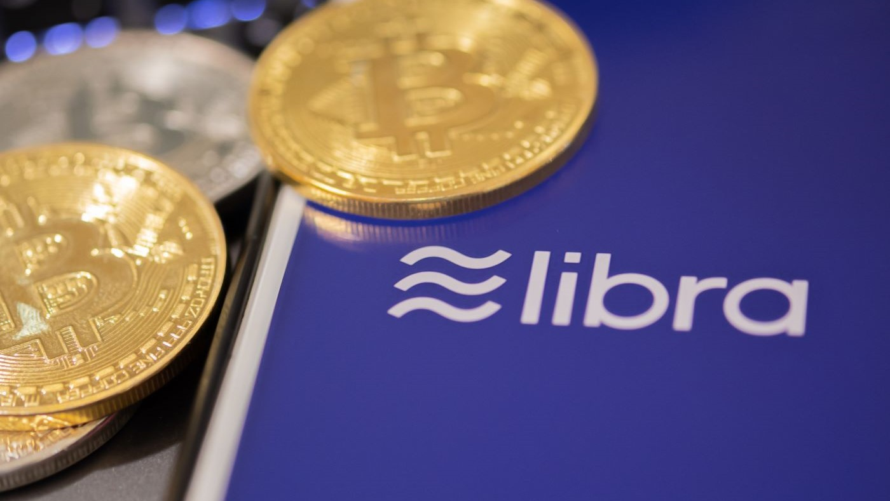
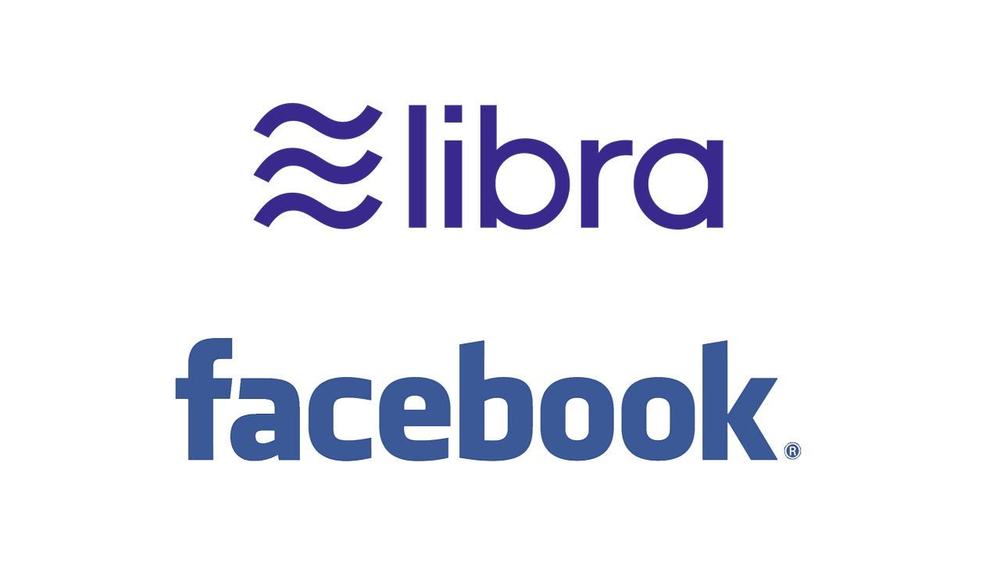

# A case study about Fintech company
## This is my submission for Homework 01
**Libra**
* Libra is a permissioned blockchain digital currency proposed by the American social media company Facebook, Inc.
The Libra Association’s mission is to enable a simple global payment system and financial infrastructure that empowers billions of people.
The currency and network do not yet exist, and only rudimentary experimental code has been released. The launch is planned to be in 2020.
* How did the idea for the company (or project) come about?
The Libra payment system is built on blockchain technology to enable the open, instant, and low-cost movement of money. People will be able to send, receive, and spend their money, enabling a more inclusive global financial system.

## Business Activities:
* What specific financial problem is the company or project trying to solve?
Facebook established the Libra Association to oversee the currency, founded in Geneva, Switzerland. Initial membership as of October 2019 was:
-	Payments: PayU Checkout.com
-	Technology and marketplaces: Facebook's subsidiary Novi Financial, Farfetch, Lyft, Spotify, Uber, Shopify
-	Telecommunications: Iliad SA, Vodafone (since left)
-	Blockchain: Anchorage, Bison Trails, Coinbase, Xapo
-	Venture capital: Andreessen Horowitz, Breakthrough Initiatives, Ribbit Capital, Thrive Capital, Union Square Ventures
-	Nonprofit and multilateral organizations, and academic institutions: Creative Destruction Lab, Kiva, Mercy Corps, Women's World Banking
* Who is the company's intended customer?  Is there any information about the market size of this set of customers?
All people who wants a secure way to invest, transfer, and deal with money.
What solution does this company offer that their competitors do not or cannot offer? (What is the unfair advantage they utilize?)
The Libra mission is to enable a simple global payment system and financial infrastructure that empowers billions of people. The Libra payment system will support single-currency stablecoins (e.g., ≋USD, ≋EUR, ≋GBP, etc.) and a multi-currency coin (≋LBR), which we refer to together as Libra Coins.
* Which technologies are they currently using, and how are they implementing them? (This may take a little bit of sleuthing–– you may want to search the company's engineering blog or use sites like Stackshare to find this information.)
They are using Rust. Rust is a multi-paradigm programming language focused on performance and safety, especially safe concurrency. Rust is syntactically similar to C++, and provides memory safety without using garbage collection.

## Landscape:
* What domain of the financial industry is the company in?
Fintech. It’s building a Financial system on the Blockchain
* What have been the major trends and innovations of this domain over the last 5-10 years?
It’s still do not yet exist.
* What are the other major companies in this domain?
Many companies are in this domain, but Libra is unique. A little like Bitcoin and a little like PayPal
## Results
* What has been the business impact of this company so far?
Trust in the safety, security, and integrity of the Libra payment system is imperative to encourage people and businesses to participate in the network. 
* What are some of the core metrics that companies in this domain use to measure success? How is your company performing, based on these metrics?
Companies are measuring their success on the number of customers they have, or the number of transactions they have in a period. Libra is getting a whole of attention.
* How is your company performing relative to competitors in the same domain?
The future is bright. Everyone trusts Facebook.
## Recommendations
* If you were to advise the company, what products or services would you suggest they offer? (This could be something that a competitor offers or use your imagination!)
Libra pay, Libra credit card, Libra saving and checking accounts, and Libra wallets.
* Why do you think that offering this product or service would benefit the company?
That will bring more customers.
* What technologies would this additional product or service utilize?
No more major technology needed.
* Why are these technologies appropriate for your solution?
That what customers miss.

References:
1-	Libra (digital currency) Wikipidia page: 'https://en.wikipedia.org/wiki/Libra_(digital_currency)'
2-	Libra White Paper: 'https://libra.org/en-US/white-paper/'

